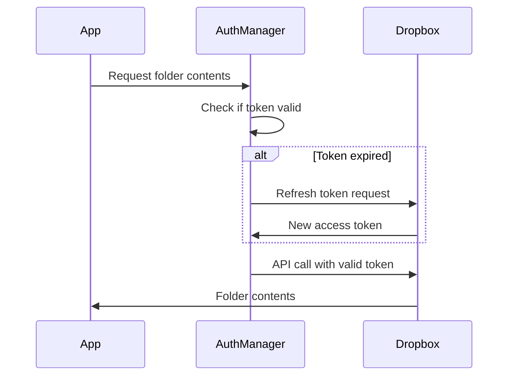

# Dropbox OAuth 2.0 Setup Guide (Updated)

## 🆕 What Changed?

The old system used **short-lived access tokens** that expired every 4 hours. The new system uses **OAuth 2.0 with refresh tokens** that automatically renew, so you never have to manually update tokens again!

---

## 🔑 One-Time OAuth Setup

### Step 1: Update Your Dropbox App Settings

1. Go to https://www.dropbox.com/developers/apps
2. Select your existing app (or create a new one)
3. Go to **Settings** tab
4. Add **Redirect URI**:
   ```
   http://localhost:3000/api/auth/dropbox/callback
   ```
   For production, also add:
   ```
   https://your-domain.vercel.app/api/auth/dropbox/callback
   ```
5. Copy your **App key** and **App secret**

### Step 2: Configure Environment Variables

Update your `.env.local` file:

```bash
# Dropbox OAuth 2.0
DROPBOX_APP_KEY=your_app_key_here
DROPBOX_APP_SECRET=your_app_secret_here
DROPBOX_REFRESH_TOKEN=  # Leave empty for now
DROPBOX_REDIRECT_URI=http://localhost:3000/api/auth/dropbox/callback
NEXT_PUBLIC_DROPBOX_APP_KEY=your_app_key_here  # Same as DROPBOX_APP_KEY
```

### Step 3: Run OAuth Flow

1. Start your development server:
   ```bash
   npm run dev
   ```

2. Navigate to:
   ```
   http://localhost:3000/admin/dropbox-setup
   ```

3. Click **"Connect Dropbox"**

4. Log in to Dropbox and authorize the app

5. You'll be redirected to a page showing your **refresh token**

6. Copy the refresh token and add it to `.env.local`:
   ```bash
   DROPBOX_REFRESH_TOKEN=your_refresh_token_here
   ```

7. Restart your dev server:
   ```bash
   # Stop server (Ctrl+C)
   npm run dev
   ```

### Step 4: Verify It Works

1. Go to `/feedback` page
2. Open **GGsheet** tab
3. Expand a job with Dropbox folder
4. Should load without errors! ✅

---

## 🚀 Deploying to Vercel

1. Go to Vercel Dashboard → Your Project → Settings → Environment Variables

2. Add these variables for **Production**, **Preview**, and **Development**:
   ```
   DROPBOX_APP_KEY=your_app_key
   DROPBOX_APP_SECRET=your_app_secret
   DROPBOX_REFRESH_TOKEN=your_refresh_token
   DROPBOX_REDIRECT_URI=https://your-domain.vercel.app/api/auth/dropbox/callback
   NEXT_PUBLIC_DROPBOX_APP_KEY=your_app_key
   ```

3. Redeploy your project

4. Visit `https://your-domain.vercel.app/admin/dropbox-setup` to verify connection status

---

## 🔧 How It Works



**Key Features:**
- ✅ Tokens automatically refresh when expired
- ✅ No manual intervention needed
- ✅ Works indefinitely (refresh tokens don't expire)
- ✅ Automatic retry on 401 errors

---

## ⚠️ Troubleshooting

### Error: "Dropbox OAuth not configured"

**Solution:** Make sure all environment variables are set:
```bash
DROPBOX_APP_KEY=...
DROPBOX_APP_SECRET=...
DROPBOX_REFRESH_TOKEN=...
```

### Error: "Token refresh failed"

**Possible causes:**
1. Refresh token is invalid or expired
2. App secret is incorrect
3. App was deleted/reset in Dropbox dashboard

**Solution:** Re-run the OAuth flow at `/admin/dropbox-setup`

### Redirect URI mismatch

**Error:** `redirect_uri_mismatch`

**Solution:** Make sure the redirect URI in your Dropbox app settings exactly matches:
- Local: `http://localhost:3000/api/auth/dropbox/callback`
- Production: `https://your-domain.vercel.app/api/auth/dropbox/callback`

### Still seeing old token errors

**Solution:** Clear the old `DROPBOX_ACCESS_TOKEN` from environment variables and restart server

---

## 🔒 Security Notes

- ✅ Refresh tokens are stored server-side only (never exposed to browser)
- ✅ Access tokens are short-lived (4 hours) and auto-refresh
- ✅ All API calls go through authentication manager
- ✅ Automatic retry on authentication failures

---

## 📊 Migration Checklist

- [ ] Update Dropbox app settings with redirect URI
- [ ] Add OAuth credentials to `.env.local`
- [ ] Run OAuth flow at `/admin/dropbox-setup`
- [ ] Copy refresh token to `.env.local`
- [ ] Restart dev server
- [ ] Test folder loading on `/feedback` page
- [ ] Update Vercel environment variables
- [ ] Deploy to production
- [ ] Verify production works
- [ ] Remove old `DROPBOX_ACCESS_TOKEN` variable

---

## ✅ Benefits Over Old System

| Old System | New System |
|------------|------------|
| ❌ Token expires every 4 hours | ✅ Never expires |
| ❌ Manual token regeneration | ✅ Automatic refresh |
| ❌ Frequent errors | ✅ Automatic retry |
| ❌ Production downtime | ✅ Always available |
| ❌ Manual intervention | ✅ Fully automated |

---

## 🎉 Done!

Once setup is complete, you'll never have to worry about expired Dropbox tokens again!
